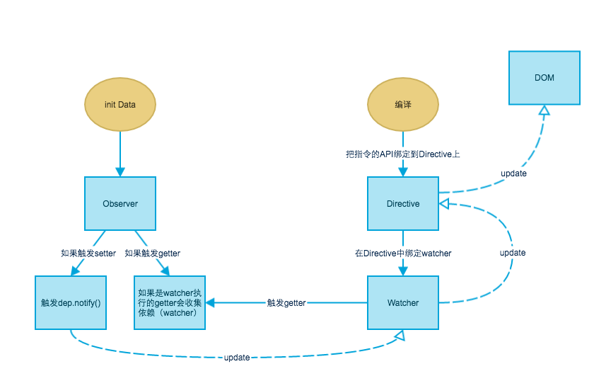

## 040010
开始介绍Vue发布-订阅模式的实现。

在继续之前，先阅读一下[Vue的响应式原理](https://cn.vuejs.org/v2/guide/reactivity.html#%E5%A6%82%E4%BD%95%E8%BF%BD%E8%B8%AA%E5%8F%98%E5%8C%96)。参考下图。我的理解是这样的，在Vue的发布-订阅模型中，Observer对应的是消息的发布者，Dep对应的是调度中心，Watcher对应的是订阅者。

一个值被转换为observer后，如果它是对象，它的子属性会被转换为响应式属性（gettser/setter），并递归创建新的observer；但如果它是数组，它的元素会被直接转换为新的observer，并不会创建响应式属性，因为不能创建存取值器。

observer，dep，watcher之间有下面的关系：
* observer 与 其观察的对象或数组是 1对1。并且对象或数组的子元素也会被观察创建 observer，也是 1对1。
* observer 的每个响应式属性 对应1个 dep。每个 observer 也对应1个dep。这个dep只有当该 observer 是一个子 observer 时才是有用的。
* 1个dep可能被多个watcher订阅，一个watcher也可能订阅了多个dep

## 040020
Observer。

在[/src/core/observer/index.js](../src/core/observer/index.js)

## 040030
Dep。

在[/src/core/observer/dep.js](../src/core/observer/dep.js)

## 040040
Watcher

在[/src/core/observer/watcher.js](../src/core/observer/watcher.js)